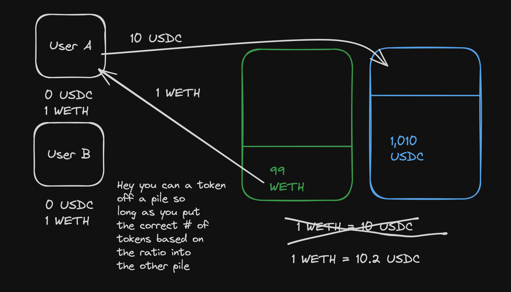
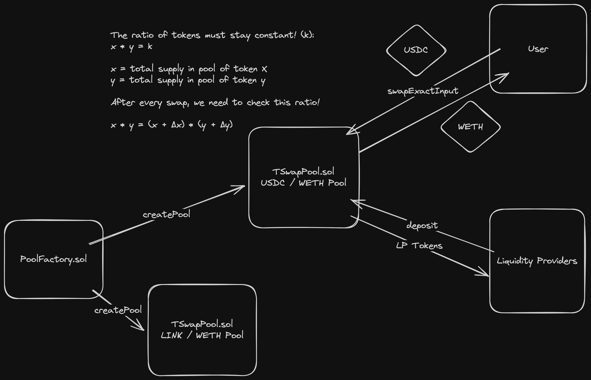

# TSwap Lesson Notes

## What is a DEX?

A decentralised Exchange (DEX) is meant to be a permissionless way for users to swap assets between each other at a fair price.

Unlink Robinhood or Coinbase, which are privately run and centralised, these exchanges are all done programatically.

[Automated Market Makers (AMMs)](https://chain.link/education-hub/what-is-an-automated-market-maker-amm) don't use a normal "order book" style exchange like what we see with the stock market of requiring someone to have a sell order in order for someone to to have a buy order to buy those shares, instead it uses "Pools" of an asset. 

Uniswap is a hugeeee DEX that is an AMM. To understand Uniswap, please watch this video: [Uniswap Explained](https://www.youtube.com/watch?v=DLu35sIqVTM)

## What is an Automated Market Maker (AMM)? How do they work?

### Some of the problems with Order Book Style Exchanges

1. Often used in centralised exchanges which means that at any point you can be locked out from your assets
2. Can be very expensive and slow because user A has to place order to sell X to buy Y, and user B then has to place order sell Y for X, then the protocol matches the trades together, carries out the trade and then removes each order from the order book.The computation to handle each order is quite complex and more computational too. This requires multiple transactions to occur and the Gas costs will be higher for each user because they have to submit multiple requests, more computations, and more time.

### 2 Questions generated when analysisng the Order Book Style of Exchange to improve upon it

1. How do we do this in 1 transaction?
2. How do we keep costs down?

The answer to both of these questions is to use Automated Market Makers (AMMs).

### AMMs - focus on Constant Product Formula AMM (note that for the examples in this section, we are excluding fees for the liquidity pool providers and we are using very small pools)

Instead of relying on an order book to track what assets are being traded, they use "Pools". The "Pools" are a collection of two assets, like USDC and WETH, and they are like reservoirs that can be tapped into.

For example:

wETH/USDC Pool contains 2 reservoirs:

- 1 reservoir of 100 wETH
- 1 reservoir of 1000 USDC

We can caclualte the ratio between the two assets by doing: `1000 USDC/ 100 wETH = 10.00`

So the ratio of USDC to wETH is 10, or to put it in a very clear manner:

- 1 wETH = 10 USDC in ratio

With this, we can create a simple rule to follow to allow people to switch between these two assets. To put it in a simplier way:

>*Hey you can take some amount of tokens from either pool as long as you put in the correct amount of the other token into its pool based on the ratio that was calculated  - which is the ratio before the trade*

So what we are saying is if you have USDC but you want wETH, you need to make sure that you deposit enough USDC that you are complying with the ratio.

Example:

- We know that the ratio is currently 10 to 1 for USDC to wETH
- We can deposit 10 USDC to get 1 wETH because that was the ratio
- After the trade, the pools of each are as follows:
  - wETH: 99
  - USDC: 1010
- This means that our ratio has also slighty changed from what it was before the trade. If we recalculate the ratio after the trade, it is now:
  - 1010 USDC / 99 wETH = 10.2
- And this actually makes sense because us buying wETH has sent the price up because of demand, making it more expensive

What we have done is programatically created a way for excahnges to be done with automated ratio pricing based on demand, all completely decentralisd and programatically operated. We have had no need for an expensive order book type system to exist, we can just rely on pools.

Of course, the examples we mentioned involved very low numbers of each token and the strenght of the ratio can cause significant market manipulation with such small pools.

#### Liquidity Providers - Why AMMs have fees

The pools are filled with people who deposit their assets to allow the swapping of assets to occur. To encourage people to fill pools with assets, a system is employed that collects a small percentage of fees when a swap occurs.

These fees aren't stored in a separate location to the pools, instead they are directyl taken during the swap and remain in the pool.

For example, if we know the ratio is 10 to 1 for USDc to wETH, and we want to swap USDC for 1 wETH we know that we need 10 USDC. However, if we employ a fee percentage of the trade as 0.03%, and we want to swap USDC for 1 wETH, we need to deposit an additional 0.03% of 10 USDC - which equates to 0.3 USDC.

So, if we want 1 wETH from USDC, we notake the fee and have to deposit 10.3 USDC to receive 1 wETH.

When a liquidity provider deposits assets into the pool, they are given a Liquidity Provider (LP) token which represents their share of the liquidity pool.

The share of pools that liquidity providers has, or the amount of the LP tokens that they have, determines how much of the pools, with collected fees, they will receive back when they withdraw their deposits.

For example:

- Pool contains 250 wETH, 2500 USDC
- Liquidity Provider hols 50 LP tokens, representing 20% of the total pool shares
- User A swaps 10.3 USDC for 1 wETH (.03 % fee)
- Updated pool: 249 wETH, 2510.3 USDC
- Liquidity provider withdraws 50 LP tokens, representing 20% of the total pool shares
  - 20% of wETH = 49.8 wETH
  - 20% of USDC = 502.06
- Of course, the amount of wETH withdrawn is less because the total pool volume is lower but their LP tokens still represent the same % of pool
- The ratio was 10:1 for USDC to wETH, and if we calculate the amount of USDC the LP now has it is greater than 10. Because 49.8 wETH should be 498 USDC with the ratio, and since we exceed this, they have made value from being a LP.
- We can calcualte the actual profit made by the LP doing the following:
  - Initial deposit = 500 USDC
  - amount of USDC against wETH has in pool from their percentage of shares (49.8 wETH) using the known ratio of 10:1 = 498 USDC
  - Amount of USDC we get with the withdrawal of our LP tokens = 502.06 USDC
  - 500 USDC was the know start point
  - Add 498 USDC and 502.06 USDC = 1000.06 USDC
  - The difference over 1000 is the profit made by the LP = 0.06 USDC (because that starting base was 500 and we worked the difference between the two values)
- The profit of 0.06 USDC is from a single swap/trade. The more swaps and trades that occur, the greater the profits the LP can make without having to do anything! --> This is yield

## Invariants & Properties

**Went through and re-created some fuzzing and stateful fuzzing (invariant) tests in the `sc-exploits-minimized` folder, I have brought them into the `./src` and `./test` folders of this structure for future reference - highly reccomend reading them. Have also updated `foundry.toml`**

We have gone over some of this previosuly, but to quickly re-hash it:

Invariants & properties are statements about the protocl that must always be true, regardless of what state changes occur.

For example, an invariant of a protocol that held tokens on someones behalf, an invariant of the system would be that a user cannot withdraw more tokens than they deposited. If there is a way for this invariant to be incorrect, then there is a bug in the system.

[crytic/properties](https://github.com/crytic/properties?tab=readme-ov-file) is a repository detailing a number of properties across common ERC standards and includes useful information on carrying out tests regarding these.

### Where Stateless Fuzzing Falls Down

Stateless fuzzing falls down when an anvairant or a property of a system requires interactions across different functions and steps.

Because normal fuzzing does not care about any previous run/attempt and it resets everytime, we do not have a series of changes that have occured to the state that can be maintained prior to testing more logic that can potentially cause the invariant to break.

### Stateful Fuzzing with Foundry

There are two main methods of carrying out some more targetted and somtimes more useful kinds of fuzzing.

**Method 1 - Open Stateful Fuzzing**

- We adjust our fuzzing configuration in `foundry.toml` where we can control:
  -  whether to fail on revert, or continue testing. Both options are valid and useful in varying situations.
     -  If our invariant is a rule that won't cause a revert in the logic, then we would set fail on revert as `false`
     -  Need to be careful too though, because what about failure of token transfers for example? There could be a revert and we want that revert there to happen to let us know
  -  How many runs of tests to do
  -  Depth of testing - the number of functions to call inside of each run
- We can also use `StdInvariant` of Foundry to give us some useful tools for more advanced stateful fuzzing - such as creating a target contract for the fuzzing test to call random functions of with random inputs.
- When we write a stateful fuzz test in Foundry, we pre-append the test with the either the keyword `invariant_` or `statefulFuzz_` prior to the rest of the test name
- It's important to note that inside of these invariant tests, we have an assertion that is checked after each run of the test
- Remember aswell that ALL public functions autoamtically have getter functions

**Method 2 - Handler for Stateful Fuzzing**

- Using a Handler contract for our fuzzing allows us to steer and control certain aspects of the state and values being supplied for the stateful fuzz tests
  - For example, if certain internal functions can only be called when an external functions receives a valid input, such as a user address, or a token address that a function takes to check if its accepted or to handle balance updates - if we don't allow or bound the paramters in some way we can be too loose and not precise enough for the depth of testing that we would actually like and can be wasting time and paths

- Handler contract can be used to direct the fuzzer to certain order of operations with some control of values if required, and even though this reduces randomness, if its known that only 1 value out of something like 2^256-1 will allow the function to continue without reverting to impact the state of the protocl - then it is worth not wasting the time testing all the rest of the values and instead actually spend the time trying to break invariants using data that is less random but way more useful

## Weird ERC20s

Weird ERC20 tokens pose one of the biggest risks to web3 security. Weird ERC20 tokens are tokens that have unexpected or surprising behaviours.

The [d-xo/weird-erc20](https://github.com/d-xo/weird-erc20) repository contains informaiton about weird ERC20 tokens, and files that demonstrate some strange behaviours that are present in the wild.

In this repo, they provide the following statement regarding ERC20:
>The ERC20 "specification" is so loosely defined that it amounts to little more than an interface declaration, and even the few semantic requirements that are imposed are routinely violated by token developers in the wild.

This highlights the importance of being aware of these and making some good premedative decisions around your protocl design. They follow on the last statement about the ERC20 specification with the following:
>This makes building smart contracts that interface directly with ERC20 tokens challenging to say the least, and smart contract developers should in general default to the following patterns when interaction with external code is required:
>
>1. A contract level allowlist of known good tokens.
>2. Direct interaction with tokens should be performed in dedicated wrapper contracts at the edge of the system. This allows the core to assume a consistent and known good semantics for the behaviour of external assets.
>
>In some cases the above patterns are not practical (for example in the case of a permissionless AMM, keeping an on chain allowlist would require the introduction of centralized control or a complex governance system), and in these cases developers must take great care to make these interactions in a highly defensive manner. It should be noted that even if an onchain allowlist is not feasible, an offchain allowlist in the official UI can also protect unsophisticated users from tokens that violate the contracts expectations, while still preserving contract level permissionlessness.

## Constant Product Formula Explained

